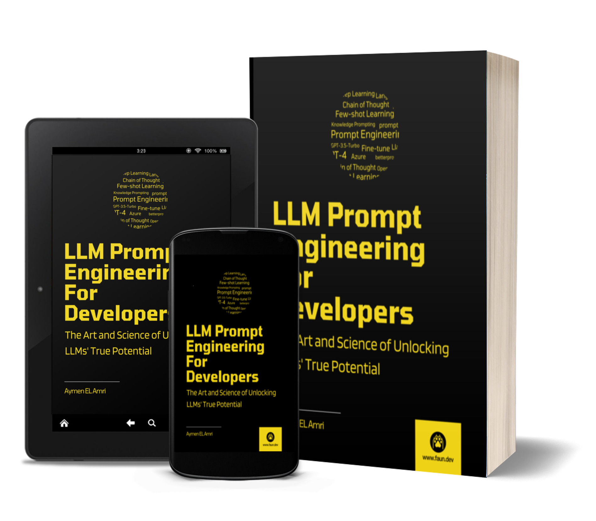

# LLM Prompt Engineering For Developers

This repository contains the code snippets used in [LLM Prompt Engineering For Developers](https://amzn.to/434YK41).

## About the Book

A practical approach to Prompt Engineering for developers. Dive into the world of Prompt Engineering agility, optimizing your prompts for dynamic LLM interactions. Learn with hands-on examples from the real world and elevate your developer experience with LLMs. Discover how the right prompts can revolutionize your interactions with LLMs.

In "LLM Prompt Engineering For Developers," we take a comprehensive journey into the world of LLMs and the art of crafting effective prompts for them.

The guide starts by laying the foundation, exploring the evolution of Natural Language Processing (NLP) from its early days to the sophisticated LLMs we interact with today. You will dive deep into the complexities of models such as GPT models, understanding their architecture, capabilities, and nuances.

As we progress, this guide emphasizes the importance of effective prompt engineering and its best practices. While LLMs like ChatGPT (GPT-3.5 and GPT-4) are powerful, their full potential is only realized when they are communicated with effectively. This is where prompt engineering comes into play. It's not simply about asking the model a question; it's about phrasing, context, and understanding the model's logic.

Through chapters dedicated to Azure Prompt Flow, LangChain, and other tools, you'll gain hands-on experience in crafting, testing, scoring and optimizing prompts. We'll also explore advanced concepts like Few-shot Learning, Chain of Thought, Perplexity and techniques like ReAct and General Knowledge Prompting, equipping you with a comprehensive understanding of the domain.

This guide is designed to be hands-on, offering practical insights and exercises. In fact, as you progress, you'll familiarize yourself with several tools:

- openai Python library: You will dive into the core of OpenAI's LLMs and learn how to interact and fine-tune models to achieve precise outputs tailored to specific needs.
- promptfoo: You will master the art of crafting effective prompts. Throughout the guide, we'll use promptfoo to test and score prompts, ensuring they're optimized for desired outcomes.
- LangChain: You’ll explore the LangChain framework, which elevates LLM-powered applications. You’ll dive into understanding how a prompt engineer can leverage the power of this tool to test and build effective prompts.
- betterprompt: Before deploying, it's essential to test. With betterprompt, you'll ensure the LLM prompts are ready for real-world scenarios, refining them as needed.
- Azure Prompt Flow: You will experience the visual interface of Azure's tool, streamlining LLM-based AI development. You'll design executable flows, integrating LLMs, prompts, and Python tools, ensuring a holistic understanding of the art of prompting.
- And more!

With these tools in your toolkit, you will be well-prepared to craft powerful and effective prompts. The hands-on exercises will help solidify your understanding. Throughout the process, you'll be actively engaged and by the end, not only will you appreciate the power of prompt engineering, but you'll also possess the skills to implement it effectively.

